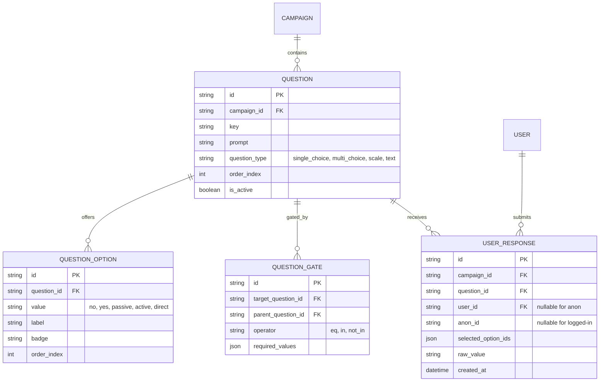

# [DRAFT] Data Model

Unified reference of the database schema. Source-of-truth detail:

- `docs/research/data-model.md` (initial v0 sketch)
- `docs/design/user-flows-and-data-architecture.md` (gated-questions target shape — authoritative for Phase 1 completion)
- `docs/architecture/community-media.md` (Phase 2 media tables)

Gated-questions migration is an **open Phase 1 item** (see [`roadmap.md`](roadmap.md)). Any PR touching the schema must align target shape with what is below.

## Better Auth (managed by library)

`user`, `session`, `account` — created and maintained by Better Auth Drizzle adapter. Do **not** hand-migrate these tables; rely on the adapter's migrations.

## Phase 1 Core Entities



Indexes / uniqueness rules:

- `UNIQUE (user_id, question_id)` and `UNIQUE (anon_id, question_id)` (partial indexes) — one response per visitor per question.
- `UNIQUE (campaign_id, key)` on `QUESTION` — slugs stable.
- `UNIQUE (question_id, order_index)` on `QUESTION_OPTION` — display order.

## Example Question Hierarchy (Nukes Campaign)

1. `q_core_stance` — root, unlocked for everyone.
   Single choice: `agree` ("Agree") / `other` ("We do | Not sure").
2. `q_commitment_tier` — gated by `q_core_stance == 'agree'`.
   Multi-select: `passive`, `active`, `direct`.
3. `q_political_action` — gated by `q_commitment_tier IN ['active', 'direct']`.
   Multi-select: `lobbying`, `divestment`, `peace_coalitions`, `public_education`.
4. `q_dissent_perspective` — gated by `q_core_stance == 'other'`.
   Single choice: `deterrence_necessary`, `geopolitical_balance`, `verification_concerns`, `undecided`.

## Phase 2 — Community Media

```sql
CREATE TABLE media_submissions (
    id TEXT PRIMARY KEY,
    user_id TEXT NOT NULL REFERENCES users(id),
    title TEXT NOT NULL,
    media_type TEXT NOT NULL,           -- 'image/webp', 'image/gif', 'video/mp4'
    r2_key TEXT NOT NULL,
    thumbnail_r2_key TEXT,
    source_url TEXT,                    -- optional TikTok / X / YouTube link
    status TEXT NOT NULL DEFAULT 'pending',  -- pending, approved, featured, flagged
    upvotes INTEGER NOT NULL DEFAULT 0,
    downvotes INTEGER NOT NULL DEFAULT 0,
    hot_score REAL NOT NULL DEFAULT 0.0,
    created_at INTEGER NOT NULL DEFAULT (unixepoch())
);

CREATE TABLE media_votes (
    media_id TEXT NOT NULL REFERENCES media_submissions(id),
    user_id TEXT NOT NULL REFERENCES users(id),
    vote_type INTEGER NOT NULL,         -- +1 upvote, -1 downvote
    created_at INTEGER NOT NULL DEFAULT (unixepoch()),
    PRIMARY KEY (media_id, user_id)
);
```

Ranking formula (Hacker-News-style time-decay):

```
Score = (U - D) / (T + 2)^G
```

Where `U` = upvotes, `D` = downvotes, `T` = hours since submission, `G` = gravity (default `1.8` for fast rotation).

Phase 2 also plans `CONTENT_VOTE`/`FAQ_ENTRY` wiki tables; deferred detail in `docs/research/data-model.md`.

## Anonymous Pledge Identity

- Anonymous voters tracked in `USER_RESPONSE.anon_id` only.
- HTTP-only `anon_id` cookie (UUIDv4) issued in SSR; `SameSite=Lax`, `Secure`, `Max-Age=1 year`.
- On sign-in, atomic migration: `UPDATE user_response SET user_id = :userId, anon_id = NULL WHERE anon_id = :anonId`.
- Same atomic claim applies to legacy `pledge` table during Phase 1 transition.
