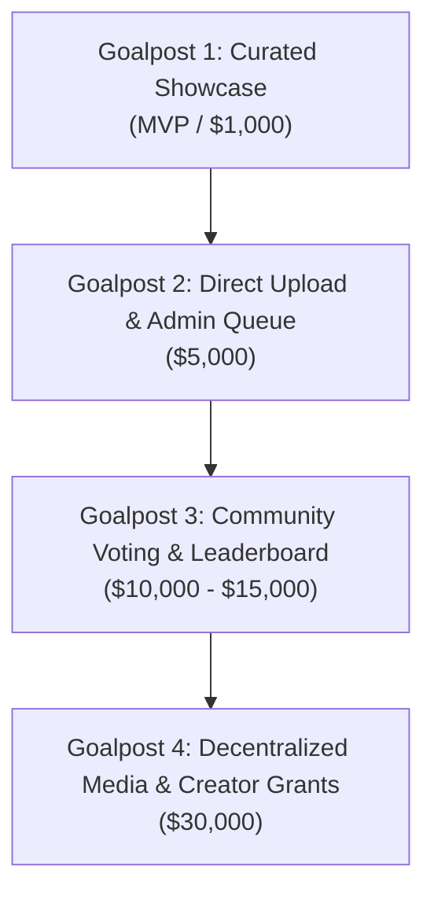

# [DRAFT] Community Media Submissions & Voting Engine

This document defines the architecture and technical goalposts for community-generated memes, videos, and campaign artwork, detailing how community contributions are submitted, moderated, voted on, and promoted directly into the official campaign.

---

## 1. Vision & Campaign Role

Community-generated media is the cultural engine of the campaign. Rather than relying solely on static top-down marketing, the campaign landing page (`wedontneednukes.org`) and social share cards are dynamically powered by top-voted community memes, graphics, and short-form video hooks.

```
┌─────────────────┐       ┌─────────────────┐       ┌──────────────────┐       ┌──────────────────────┐
│ Community User  │ ───>  │ Direct R2 Upload│ ───>  │ Community Voting │ ───>  │ Featured on Campaign │
│ Creates Meme/Vid│       │ (Presigned URL) │       │ (Hot/Rank Score) │       │ Landing & Share Cards│
└─────────────────┘       └─────────────────┘       └──────────────────┘       └──────────────────────┘
```

---

## 2. Technical Architecture

### 2.1 Media Upload Pipeline (Edge-Direct)
To prevent Cloudflare Workers memory and execution limits from choking on large binary files (e.g. 10MB–50MB short videos), uploads bypass the Worker runtime using **Cloudflare R2 Presigned S3 URLs**:

1. **Upload Request**: Client sends a POST request with media metadata (file name, MIME type, size, SHA-256 hash).
2. **Auth & Rate Limiting Gate**: Worker verifies active pledger session (Better Auth) and rate limit (e.g., max 3 submissions per user per week).
3. **Presigned URL Issuance**: Worker generates a short-lived PUT URL for Cloudflare R2 via AWS SDK S3 client.
4. **Direct Client Upload**: Browser directly PUTs the binary file to R2.
5. **Confirmation & Queueing**: Client notifies the Worker when complete; a record is created in D1 SQLite with status `pending_review` or `unranked`.

### 2.2 Data Model (D1 SQLite Schema)

```sql
CREATE TABLE media_submissions (
    id TEXT PRIMARY KEY,
    user_id TEXT NOT NULL REFERENCES users(id),
    title TEXT NOT NULL,
    media_type TEXT NOT NULL, -- 'image/webp', 'image/gif', 'video/mp4'
    r2_key TEXT NOT NULL,
    thumbnail_r2_key TEXT,
    source_url TEXT,          -- optional external link (e.g. TikTok, X, YouTube)
    status TEXT NOT NULL DEFAULT 'pending', -- 'pending', 'approved', 'featured', 'flagged'
    upvotes INTEGER NOT NULL DEFAULT 0,
    downvotes INTEGER NOT NULL DEFAULT 0,
    hot_score REAL NOT NULL DEFAULT 0.0,
    created_at INTEGER NOT NULL DEFAULT (unixepoch())
);

CREATE TABLE media_votes (
    media_id TEXT NOT NULL REFERENCES media_submissions(id),
    user_id TEXT NOT NULL REFERENCES users(id),
    vote_type INTEGER NOT NULL, -- +1 for upvote, -1 for downvote
    created_at INTEGER NOT NULL DEFAULT (unixepoch()),
    PRIMARY KEY (media_id, user_id)
);
```

### 2.3 Community Voting & Ranking Algorithm
To keep content fresh and prevent early submissions from permanently monopolizing the top spots, we implement a time-decay ranking algorithm (similar to Hacker News or Reddit "Hot"):

$$\text{Score} = \frac{U - D}{(T + 2)^G}$$

Where:
* $U$ = Upvotes, $D$ = Downvotes
* $T$ = Hours elapsed since submission
* $G$ = Gravity constant (default: 1.8 for rapid rotation)

#### Anti-Sybil & Manipulation Guards
* **Pledge Gate**: Only users who have completed at least Step 1 of the pledge can vote.
* **1 Vote Per Media Item**: Enforced by compound primary key `(media_id, user_id)`.
* **Turnstile Protection**: Cloudflare Turnstile token validated on submission and vote actions.
* **Reputation Weighting (Future)**: Voters with verified identity or social auth have higher vote weight than fresh anonymous accounts.

---

## 3. Technical Implementation Goalposts

These goalposts map directly to platform funding and development milestones:



### Goalpost 1: Curated Media Showcase (MVP / $1,000)
* Static community meme/video carousel on the campaign hero page.
* Manual submissions via Discord / GitHub issues or social hashtag `#WeDontNeedNukes`.
* Curated media hosted on static assets / R2 CDN.

### Goalpost 2: Direct Upload & Moderation Queue ($5,000)
* Authenticated pledgers can upload images (PNG, WebP, GIF) and short video clips directly from the campaign portal.
* Direct-to-R2 presigned upload pipeline.
* Basic admin moderation dashboard for campaign stewards to approve/reject submissions before public display.

### Goalpost 3: Public Voting, Hot Ranking & Landing Integration ($10,000 – $15,000)
* Interactive Community Media Gallery (`/community/media`).
* 1-click upvoting for authenticated pledgers.
* "Hot" and "All-Time Top" algorithmic sorting.
* **Landing Page Autopilot**: Top 5 trending community memes of the week are automatically syndicated into the **Hero Carousel** on `wedontneednukes.org`.
* **Dynamic Social Share Badges**: Pledgers can choose any trending community meme as the preview background for their personalized pledge share card.

### Goalpost 4: Decentralized Storage, Crypto Voting & Creator Grants ($30,000)
* **IPFS / Arweave Mirroring**: Top-voted cultural artifacts are permanently pinned to decentralized storage for censorship resistance.
* **Quadratic / Token-Weighted Voting**: Optional on-chain / verifiable credential voting to ensure bulletproof democratic curation.
* **Community Creator Micro-Grants**: Monthly micro-grants funded through OpenCollective allocated directly to the creators of the month's top 3 community memes/videos.
