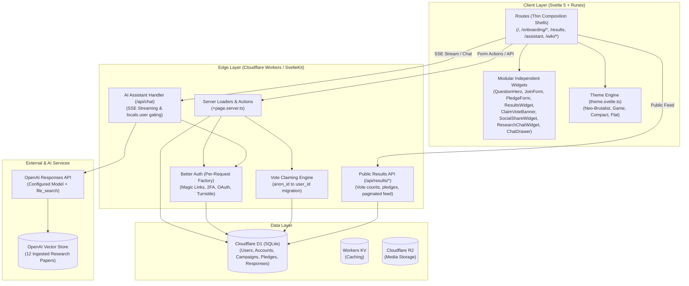

# [ESTABLISHED] Architecture Overview

## High-Level System Architecture

See the detailed subsystems:
- [AI Assistant & Research Grounding Engine](ai-assistant.md)
- [Pledge Flow Engine](pledge-engine.md)
- [Community Media Submissions & Voting Engine](community-media.md)
- [User Flows, Form Modularization & Gated Questions Architecture](../design/user-flows-and-data-architecture.md)

## Key Architectural Principles

- **Edge-first**: Server rendering (SSR), API endpoints, and database queries run natively at the Cloudflare edge via `@sveltejs/adapter-cloudflare`.
- **Modular Widgets**: UI forms and page sections are decomposed into independent, composable widgets under `src/lib/components/widgets/`. Routes act as lean wrappers that assemble widgets with minimal presentation code.
- **Anonymous-First with Seamless Conversion**: Supporters can vote and pledge anonymously with bot mitigation via Turnstile and an HTTP-only `anon_id` cookie. When they authenticate, an atomic database transaction links their recorded votes to their new user account.
- **Grounded AI Research Assistant**: Edge-streamed RAG pipeline (`/api/chat`, `ResearchChatWidget.svelte`, `ChatDrawer.svelte`) grounded in 12 authoritative nuclear treaty and disarmament publications via OpenAI's Responses API and vector search.
- **Decoupled Centralized Configuration**: System prompts, AI models, starter inquiries, document metadata catalogs, official social channels, and transactional email templates are isolated in dedicated configuration hubs (`src/lib/config/` and `src/lib/server/config/`), with runtime environment overrides supported.
- **Privacy-Guaranteed Public Results**: Public analytics at `/results` and `/results/votes` provide transparency while enforcing zero data leakage for anonymous voters and private supporters.
- **Campaign-agnostic**: The core application logic revolves around flexible campaign and pledge definitions, avoiding hardcoded campaign content in infrastructure code.
- **Multi-Theme Neo-Brutalism**: The visual system pairs bold neo-brutalist styling with a runes-based dynamic theme switcher (`src/lib/theme.svelte.ts`) supporting alternative presets (Rounded 2D Game, Ultra-Compact, Clean Flat) without stylesheet overhead.
- **AI-first Development Workflow**: Development is optimized for AI coding agents through thorough context files in `.ai/`, strict TypeScript types, and comprehensive automated verification (`pnpm check`, `pnpm test`, `pnpm build`).

