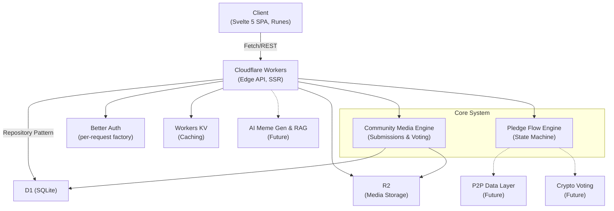

# [DRAFT] Architecture Overview

## High-Level System Architecture

See the detailed subsystems:
- [Pledge Flow Engine](pledge-engine.md)
- [Community Media Submissions & Voting Engine](community-media.md)

## Key Architectural Principles

- **Edge-first**: Everything runs at the edge on Cloudflare Workers/Pages for fast global response times.
- **Campaign-agnostic**: The core application logic revolves around the **Pledge Flow Engine**. Campaigns (like nuclear disarmament) are defined as data (JSON graphs), not hardcoded logic.
- **Modular DB**: We use a repository pattern abstraction on top of Drizzle ORM and Cloudflare D1. This allows for adapter swapping and simplified testing.
- **Progressive Engagement Funnel**: Users start with a simple landing page and progressively engage through the pledge engine, leading to action pages.
- **AI-first Development Workflow**: The "AI-first" philosophy applies to the *development workflow*. This means providing comprehensive context files and documentation optimized for AI coding agents, rather than embedding raw AI features directly into the MVP UI.
