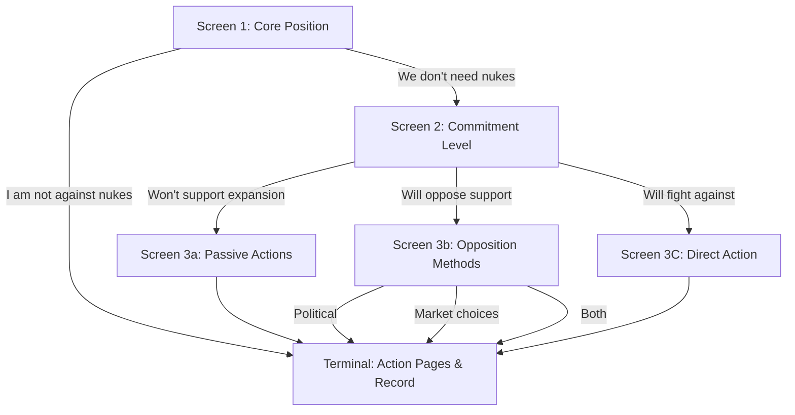

# [DRAFT] Pledge Flow Engine

## The Concept

The pledge flow engine is the core innovation of the platform. Instead of hardcoding steps and logic for a specific campaign, the engine parses campaign flows defined as data.

- **Flows as JSON Directed Graphs**: A campaign's pledge process is a directed graph.
- **Nodes**: Each node represents a screen with choices.
- **Edges**: Each edge represents a choice that leads to another node or a terminal endpoint.
- **State Machine Engine**: The engine acts as a state machine that traverses the graph based on user input.
- **FAQ Integration**: Each choice block includes contextual links to an FAQ topic.
- **Terminal Nodes**: Terminal nodes record the final pledge, capturing the full path the user took.

## Example Flow: Nuclear Disarmament



## JSON Schema Shape (Conceptual)

```json
{
  "id": "nukes",
  "nodes": [
    {
      "id": "core-position",
      "type": "choice",
      "title": "What is your stance on nuclear weapons?",
      "choices": [
        {
          "id": "not-against",
          "label": "I am not against nuclear weapons",
          "faqTopic": "why-pledge"
        },
        {
          "id": "dont-need",
          "label": "We don't need nukes",
          "faqTopic": "why-pledge"
        }
      ]
    }
  ],
  "edges": [
    {
      "from": "core-position",
      "choice": "not-against",
      "to": "terminal-dissent"
    },
    {
      "from": "core-position",
      "choice": "dont-need",
      "to": "commitment-level"
    }
  ],
  "entryNode": "core-position"
}
```
