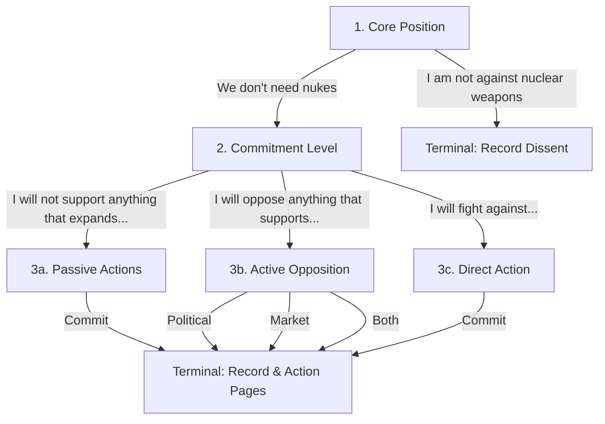

# [DRAFT] Nuclear Disarmament Pledge Flow

## Flow Tree Definition

This document outlines the full flow tree, screens, choices, and branching for the `nukes` campaign. This content will ultimately be serialized into the `nukes.json` flow file for the pledge engine.

### Screens & Branching

1. **Screen 1: Core Position**
   - **Choice A**: "I am not against nuclear weapons" → *Terminal* (Record dissent, Thank you screen)
   - **Choice B**: "We don't need nukes" → *Go to Screen 2*

2. **Screen 2: Commitment Level**
   - **Choice A**: "I will not support anything that expands nuclear weapons" → *Go to Screen 3a*
   - **Choice B**: "I will oppose anything that supports nuclear weapons" → *Go to Screen 3b*
   - **Choice C**: "I will fight against nuclear weapons" → *Go to Screen 3c*

3. **Screen 3a: Passive Actions**
   - Specific passive commitments (e.g., divestment checking, awareness).
   - *All choices* → *Terminal* (Action Pages)

4. **Screen 3b: Active Opposition**
   - **Choice A**: "I will oppose expansion politically and ideologically"
   - **Choice B**: "I will oppose expansion through market choices"
   - **Choice C**: "Both"
   - *All choices* → *Terminal* (Action Pages)

5. **Screen 3c: Direct Action**
   - Specific direct action commitments (e.g., protesting, organizing).
   - *All choices* → *Terminal* (Action Pages)

## Flow Diagram

## FAQ Links per Choice
- Screen 1 choices link to: *Why pledge against nuclear weapons?*
- Screen 2 choices link to: *What does "not supporting expansion" mean practically?*
- Screen 3b market choices link to: *What are market-based opposition strategies?*
- Screen 3b political choices link to: *What political actions can I take?*
