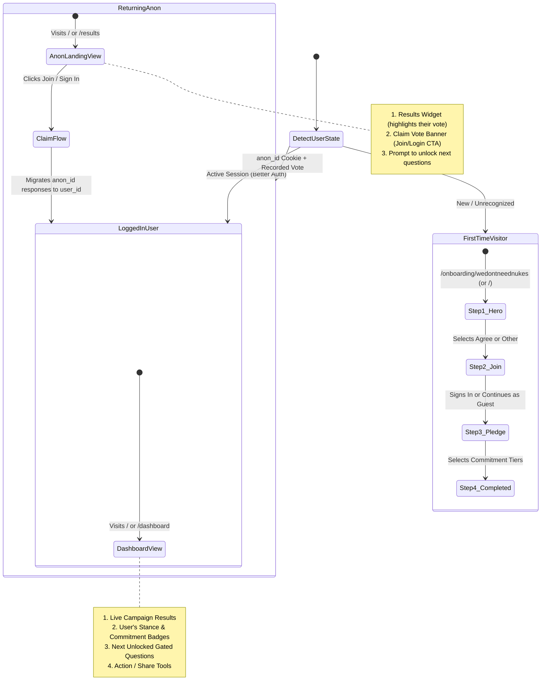
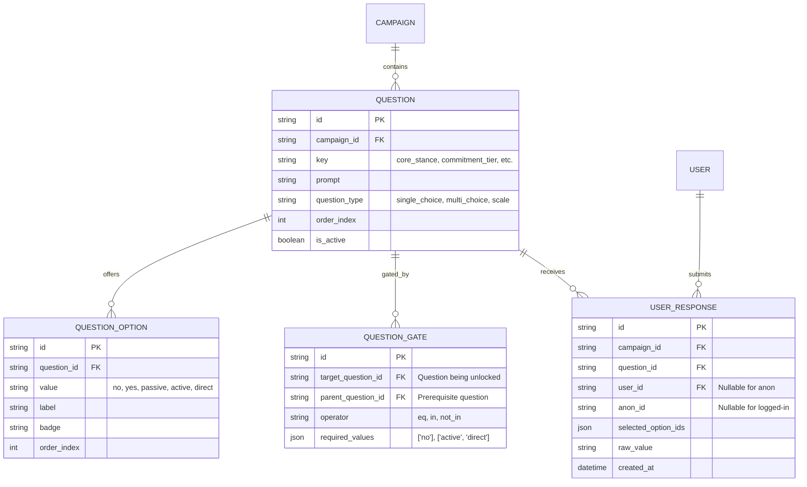

# User Flows, Form Modularization & Gated Questions Architecture

## Overview

This document outlines the user flow architecture, component modularization, anonymous state strategy, and the extensible gated-questions data layer for **We Don't Need Nukes**.

---

## 1. User Flows & State Detection

The application dynamically routes visitors based on their identity and prior engagement:



### Flow Matrix

| Visitor State | Entry Point | Primary View | CTAs / Capabilities |
| :--- | :--- | :--- | :--- |
| **New Visitor** | `/` or `/onboarding/wedontneednukes` | **Hero Question**: *"We don't need Nukes !"*, "Why?", Agree / Other | Answers question → moves to `/onboarding/join` |
| | `/onboarding/join` | **Join Form**: Social OAuth, Magic link, or "Continue as guest" | Signs in or skips → moves to `/onboarding/pledge` |
| | `/onboarding/pledge` | **Pledge Form**: Multi-select tiers (Passive, Active, Direct) | Submits → moves to `/results` or `/dashboard` |
| **Returning Anon** | `/` or `/results` | **Results + Claim Card**: Live stats with "You" badge + inline Join card | "Claim your vote & unlock follow-up questions" |
| **Returning Logged-in** | `/` or `/dashboard` | **Dashboard**: Live stats, active commitments, next unlocked question | Answer follow-up question, edit pledge, share campaign |

---

## 2. Component Modularization

Form logic is decoupled from top-level routes into reusable widgets located in `src/lib/components/widgets/`:

- **`<QuestionHeroWidget />`**: Primary premise ("We don't need Nukes !"), "Why?" link, and big choice buttons.
- **`<JoinFormWidget />`**: Magic link + OAuth + Turnstile + guest/skip option. Configurable between full-page and compact banner modes.
- **`<PledgeFormWidget />`**: Multi-select commitment tiers (`passive`, `active`, `direct`) with descriptions and optional comment.
- **`<ResultsWidget />`**: Live animated progress bars showing Agree vs Other distributions with the personalized "You" marker.
- **`<ClaimVoteBanner />`**: Callout prompting anonymous visitors to claim their vote and save their record permanently.
- **`<GatedQuestionWidget />`**: Dynamic renderer for whichever follow-up question is currently unlocked for the user.

---

## 3. Anonymous Session & Persistence Strategy

### What is Stored for Anonymous Users?
1. **HTTP-only Cookie (`anon_id`)**:
   - Random UUID (v4) set with `HttpOnly`, `SameSite=Lax`, `Secure`, and `Max-Age=1 year`.
   - **Why?** Enables instant server-side SSR routing in SvelteKit `+page.server.ts` before any HTML is sent to the client, preventing flash-of-unauthenticated-content (FOUC).
2. **Server DB Record (`user_response` / `pledge`)**:
   - Stores `anon_id`, `question_id`, selected choice/options, and timestamp.
3. **Client LocalStorage Cache (`wdnn_anon_state`)**:
   - Caches the choice and timestamp for instant client-side hydration and optimistic UI rendering.

### Vote Claiming & Account Linking
When an anonymous visitor later registers or logs in:
1. The auth callback or sign-in handler checks for an active `anon_id` cookie.
2. An atomic SQL transaction updates all responses linked to that `anon_id`:
   ```sql
   UPDATE user_response
   SET user_id = :userId, anon_id = NULL
   WHERE anon_id = :anonId;
   ```
3. The user is redirected to `/dashboard`, retaining their full voting and pledge history.

---

## 4. Gated Questions Data Layer

Rather than hardcoded columns on the `pledge` table, a question-tree model allows chaining arbitrary follow-up questions gated by previous answers.



### Concrete Question Hierarchy Example
1. **`q_core_stance`** (Root Question — unlocked for everyone):
   - *"We don't need nukes"*
   - Options: `agree` (no nukes), `other` (we do | not sure)
2. **`q_commitment_tier`** (Gated: `q_core_stance == 'agree'`):
   - *"Choose your commitment level"*
   - Options: `passive` (Baseline), `active` (Civic), `direct` (Action)
3. **`q_political_action`** (Gated: `q_commitment_tier IN ['active', 'direct']`):
   - *"Which civic/political actions do you support?"*
   - Options: `lobbying`, `divestment`, `peace_coalitions`, `public_education`
4. **`q_dissent_perspective`** (Gated: `q_core_stance == 'other'`):
   - *"What is your main perspective regarding nuclear weapons?"*
   - Options: `deterrence_necessary`, `geopolitical_balance`, `verification_concerns`, `undecided`
