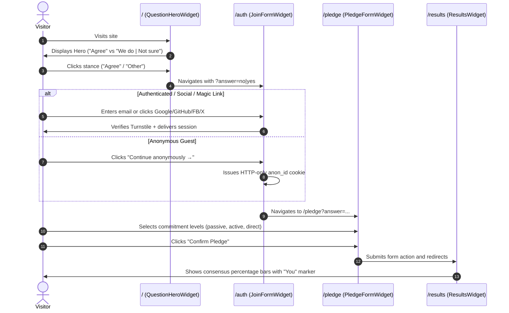
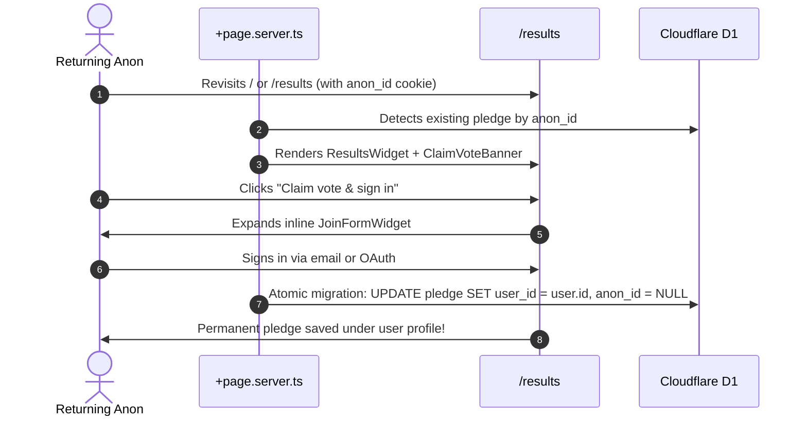
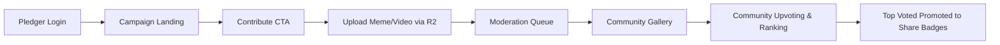

# [ESTABLISHED] User Flows

For full data schemas, anonymous identity strategy, and gated question trees, see [User Flows, Form Modularization & Gated Questions Architecture](user-flows-and-data-architecture.md).

---

## Flow 1: First-Time Visitor Journey



---

## Flow 2: Returning Anonymous Visitor (Vote Claiming)



---

## Flow 3: Returning Authenticated User

```mermaid
graph LR
    A[Direct URL or Returning] --> B[Server Loader +page.server.ts]
    B -->|Active Session| C[/pledge or /results]
    C --> D[View Stance & Edit Pledge]
    D --> E[Settings & Profile Management]
    E --> F[Share Campaign]
```

---

## Flow 4: Content Contributor & Community Media (Phase 2)



---

## Flow 5: Contextual Guidance & FAQ

Each commitment level and stance choice contains integrated `InfoTooltip` controls operating in responsive mode:
- On mobile devices: compact tap/hover popup tooltip.
- On desktop devices: permanent inline helper text for rapid visual scanning.
