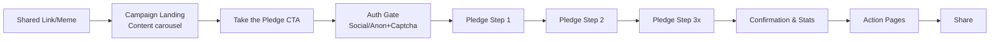
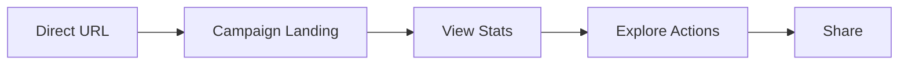
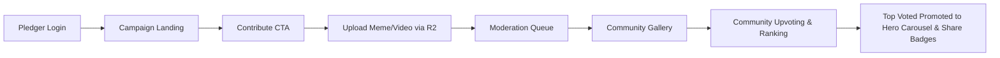
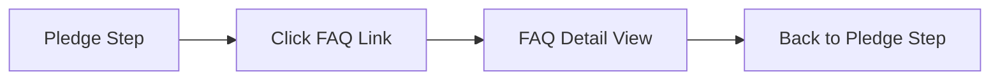

# [DRAFT] User Flows

## Flow 1: First-time Visitor Pledge Journey

```mermaid
graph LR
    A[Shared Link/Meme] --> B[Campaign Landing\nContent carousel]
    B --> C[Take the Pledge CTA]
    C --> D[Auth Gate\nSocial/Anon+Captcha]
    D --> E[Pledge Step 1]
    E --> F[Pledge Step 2]
    F --> G[Pledge Step 3x]
    G --> H[Confirmation & Stats]
    H --> I[Action Pages]
    I --> J[Share]
```

## Flow 2: Returning User

```mermaid
graph LR
    A[Direct URL] --> B[Campaign Landing]
    B --> C[View Stats]
    C --> D[Explore Actions]
    D --> E[Share]
```

## Flow 3: Content Contributor & Community Voting

```mermaid
graph LR
    A[Pledger Login] --> B[Campaign Landing]
    B --> C[Contribute CTA]
    C --> D[Upload Meme/Video via R2]
    D --> E[Moderation Queue]
    E --> F[Community Gallery]
    F --> G[Community Upvoting & Ranking]
    G --> H[Top Voted Promoted to Hero Carousel & Share Badges]
```

## Flow 4: FAQ Reader

```mermaid
graph LR
    A[Pledge Step] --> B[Click FAQ Link]
    B --> C[FAQ Detail View]
    C --> D[Back to Pledge Step]
```
