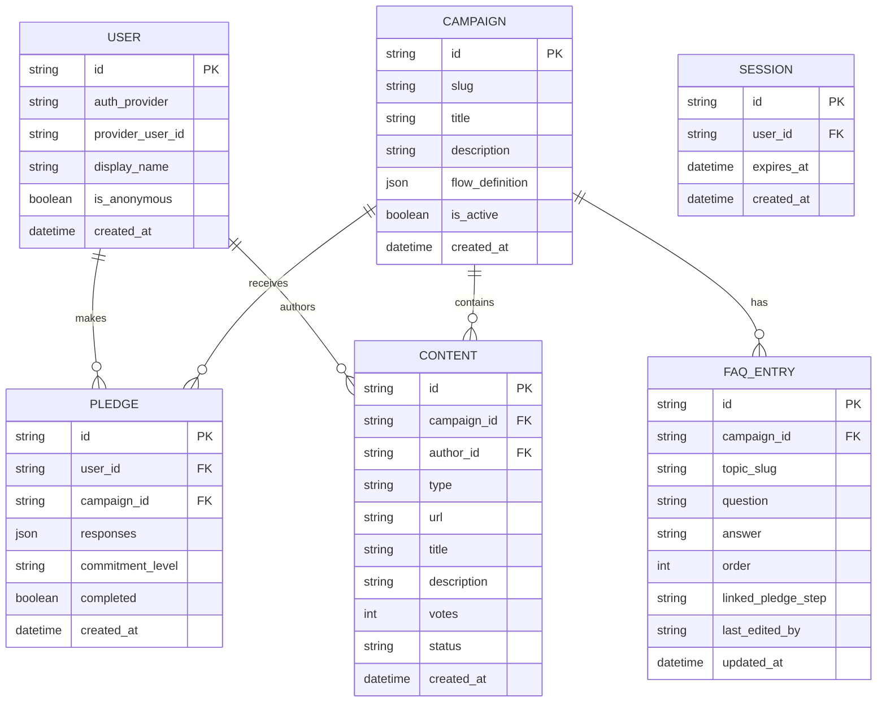

# [RESEARCH / EXPLORATION] Data Model

This document outlines the proposed database schema for the WeDoNotNeedNukes project.

## Entity Relationship Diagram

## Table Descriptions

### USER
Core user identity.
- `id`: Primary key.
- `auth_provider`: Identifies how the user authenticated (e.g., github, google, anonymous).
- `provider_user_id`: External ID from the auth provider.
- `display_name`: Chosen public name.
- `is_anonymous`: Boolean flag.
- `created_at`: Timestamp.

### SESSION
Session tracking (primarily managed by Better Auth).
- `id`: Primary key.
- `user_id`: Foreign key to `USER`.
- `expires_at`: Expiration timestamp.
- `created_at`: Creation timestamp.

### CAMPAIGN
Defines a specific pledge campaign (e.g., "nukes").
- `id`: Primary key.
- `slug`: URL-friendly identifier.
- `title`: Campaign name.
- `description`: Campaign details.
- `flow_definition`: JSON representing the entire JSON graph/flow of the pledge process.
- `is_active`: Boolean flag.
- `created_at`: Timestamp.

### PLEDGE
A user's commitment to a specific campaign.
- `id`: Primary key.
- `user_id`: Foreign key to `USER`.
- `campaign_id`: Foreign key to `CAMPAIGN`.
- `responses`: JSON array storing the user's path (e.g., `[{node_id, choice_id, timestamp}]`).
- `commitment_level`: Enum (passive, active, direct).
- `completed`: Boolean indicating if the flow was finished.
- `created_at`: Timestamp.

### CONTENT
Community-generated content for a campaign.
- `id`: Primary key.
- `campaign_id`: Foreign key to `CAMPAIGN`.
- `author_id`: Foreign key to `USER`.
- `type`: Enum (meme, video, image, text).
- `url`: Resource link (e.g., R2 bucket URL).
- `title`: Content title.
- `description`: Content description.
- `votes`: Score.
- `status`: Enum (pending, approved, rejected) for moderation.
- `created_at`: Timestamp.

### FAQ_ENTRY
Frequently asked questions linked to a campaign.
- `id`: Primary key.
- `campaign_id`: Foreign key to `CAMPAIGN`.
- `topic_slug`: URL-friendly topic identifier.
- `question`: The question text.
- `answer`: Markdown content for the answer.
- `order`: Integer for sorting.
- `linked_pledge_step`: Optional ID of a pledge flow step this relates to.
- `last_edited_by`: Tracking editors.
- `updated_at`: Timestamp.

## Relationships
- `USER` 1→N `PLEDGE`
- `CAMPAIGN` 1→N `PLEDGE`
- `CAMPAIGN` 1→N `CONTENT`
- `CAMPAIGN` 1→N `FAQ_ENTRY`
- `USER` 1→N `CONTENT`

## Notes
- **Better Auth** manages its own user/session/account tables. The schema above illustrates conceptual data requirements.
- `flow_definition` stores the *entire* JSON graph for the campaign.
- `responses` stores the user's navigated path: an array of `{node_id, choice_id, timestamp}`.
- **Future Considerations**: 
  - `PLEDGE_RESPONSE` as a separate table for detailed analytics. (Deferred to later).
  - `CONTENT_VOTE` join table to prevent duplicate voting on content. (Phase 2).
